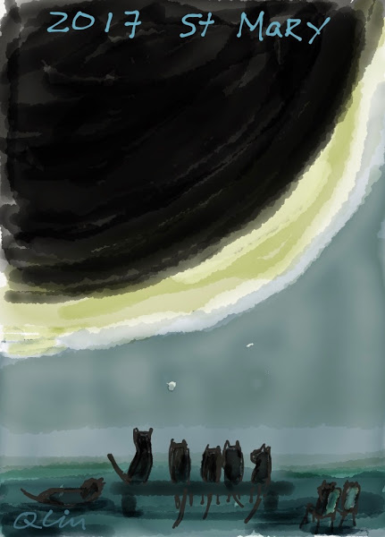

# It's Display the result here. and this is my first website.

The current weather in Saint Louis is Display the result here.

Thanks to Steven and Greg for teaching the magic

## Feels life changing...opening up a whole new world.

* To see my very first effort go [here](page2.html).

* [Here's what they taught me](howto.html) about using **Atom** and the **command line.**

* And for an explanation of how to add content using only **GitHub pages** go *[here](page3.html)*.

* I even added a special page for [Tech Randy](techrandy.html).

* Greg then taught me how to [add dynamic content](dynamicfeature.html) to an otherwise static website and how to [use an API](addapi.html) to pull data into the website.

It's still all very mysterious but nothing quite like...

